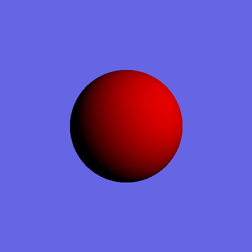
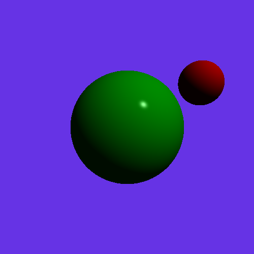
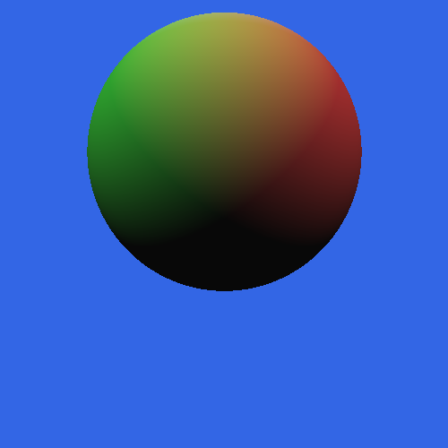
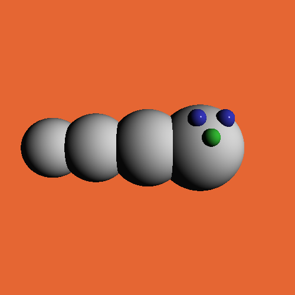
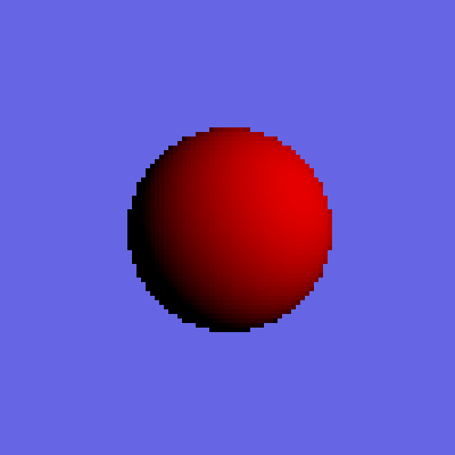
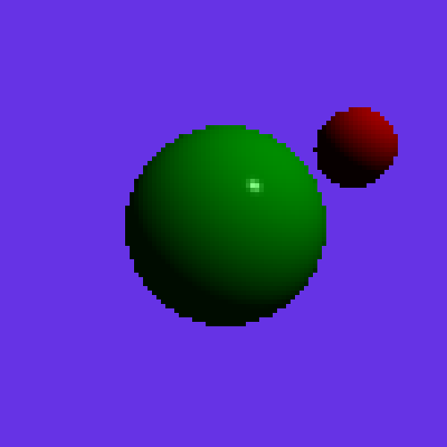
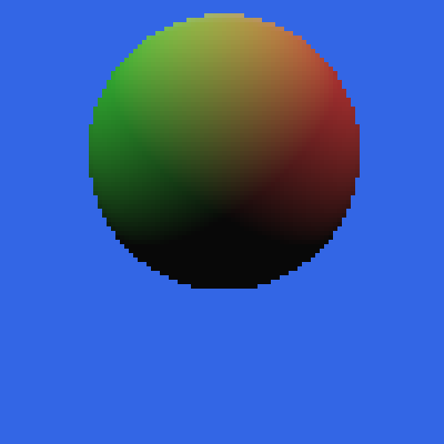
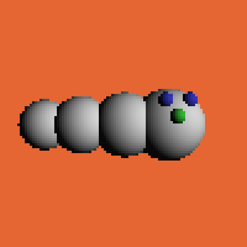

[](https://classroom.github.com/online_ide?assignment_repo_id=6160591&assignment_repo_type=AssignmentRepo)
# A3a:  Ray Tracing Spheres

This project is to write a ray tracing renderer. I wrote a collection of Javascript functions that, when called, create a 3D scene and produce 2D images of the scene. One of the functions initializes the scene, others create objects, lights and a virtual camera, and one additional function determines the color of a ray cast into the scene, that will be used to render the scene into a 2D image. 

This is the first half of a two-part project. For this first part you will cast eye rays into the scene for each pixel, test these rays for intersection with sphere objects, and then use the the Lambertian shading equation (ambient + diffuse + specular) to find the color for each pixel. In the second half of the project, [![A3b]](https://github.com/cs3451-f21/assignment-3b-disks-area-lights-and-distribution-jxu443), I expanded my Ray Tracer to detect intersections between rays and disks. I also expanded my shading function to cast shadows, reflected rays, support area lights, and implement distribution raytracing.

## Objectives

1. Dedined `eyeRay(i,j)` using `set_fov()` and `set_eye()` 
2. `reset_scene()` empties the scene,  including resetting background and ambient light. `ambient_light` and `set_background()` set values to be used by ray color calculation.
3. Created scene arrays. `new_light()`, `new_sphere()` for 3D objects 
4. `traceRay()` finds the closest point on one of the spheres and calls some method to compute the color for it.
5. Calculated color for ray includes correct ambient contribution (ambient + diffuse + specular)

## Project Description

There are four primary steps for this project:

1. Initialize the scene 
2. Cast eye rays for each pixel
3. Implement detection of ray intersection with spheres
4. Implement the shading equation

# Scene Description Language

Each scene is described by calling several methods on the RayTracer object that set up and render the scene.  

Below are the methods that I implemented:

##### `reset_scene ()`

Initialize all the data structures and variables so you can start with an empty scene.

##### `set_background (r, g, b)`

Sets the background color. If a ray misses all the objects in the scene, the pixel should be given this color.

##### `set_fov (angle)`

Specifies the field of view (in degrees) for perspective projection. Default value 90. You will need to convert this to the focal length d.  You will then use this together with the eye position and the u, v, and w vectors of the eye's rotation matrix to create the eye rays.

##### `set_eye (cx, cy, cz, lx, ly, lz,  ux, uy, uz)`

Specifies the eye position (cx,cy,cz) in 3D coordinates along with a lookat point (lx,ly,lz) that define the position and direction the camera is looking. An up vector (ux, uy, uz) allows you to set the full orientation of the camera.  Camera is at the origin, looking down the -z axis by default.

##### `new_light (r, g, b, x, y, z)`

Create a point light source at position (x,y,z) and its color (r, g, b). Your code should allow at least 10 light sources. For the second part of this assignment, you will cause these lights to cast shadows.

##### `ambient_light (r, g, b)`

Create an "ambient" light with color (r, g, b), in order to approximate indirect illumination. There is only one ambient light; multiple calls will just replace the ambient light.

##### `new_sphere  (x, y, z, radius, dr, dg, db, k_ambient, k_specular, specular_power)`

Specifies the creation of a sphere with its center at (x, y, z) and with a given radius.  The diffuse color of the sphere is given by (dr, dg, db).  The coefficient k_ambient specifies how much of the ambient light combines with the diffuse color of the surface.  For this project, we will assume that all specular highlights are white, and the brightness of the highlight is given by k_specular. The tightness of the highlight is guided by specular_power. 

##### `draw_scene()`

Ray-traces the scene and displays the image in the canvas region in your browser.  We have provided this method, but you will need to implement two internal methods, `traceRay(ray)` and `eyeRay(i,j)`, that this method calls.

Note on color specification: Each of the red, green, and blue components for the above commands are floating point values in the range of 0.0 to 1.0.

# Results

Below are my image screen shots when pressing the keys 1-4. No scene is generated when the program starts, you will just see a light yellow canvas. Key 0 will draw an empty scene with just the background color.







The canvas is a fixed size (the number of pixels in the canvas), specified in the RayTracer object constructor. The constructor also allows you to set the number of virtual pixels that will be ray traced; these should be smaller than the number of pixels in the canvas (ideally simple fractions of them). It will draw larger "pixels" in the canvas so it is filled.  Using smaller numbers of virtual pixels will make debugging faster. 

The sample project is set up with a 500x500 pixel canvas, but only renders 100x100 virtual pixels, resulting in 5x5 canvas pixels for each virtual ray-traced pixel. The sample scenes will look like this with these settings.






# Compile and Run

1. cd into the directory and run ```npm install```
2. run with ```npm run dev```
3. visit ```http://localhost:3000/index.html```

Please test that your submission meets these requirements.  For example, after you check in your final version of the assignment to github, check it out again to a new directory and make sure everything builds and runs correctly.

# Recources
base code: https://github.com/cs3451-f21/a3a-ray-tracing-spheres-vsantino720 from Gatech CS3451
